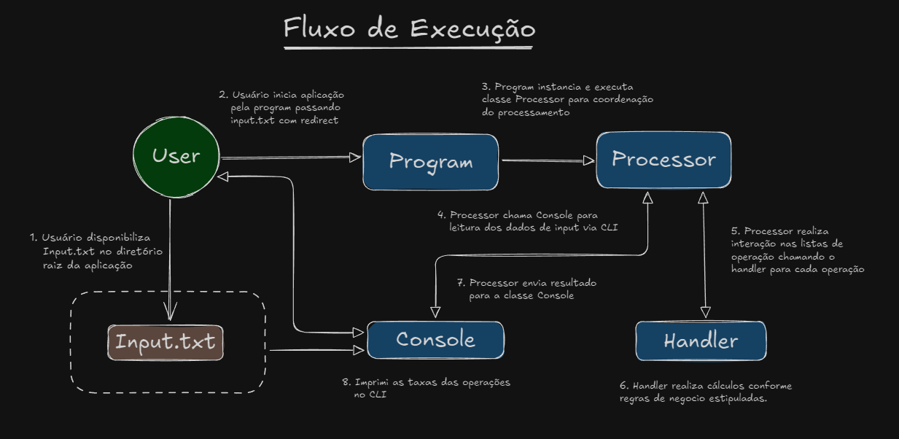

# **Code Challenge - Capital Gains**

Solução para processamento e calculo da taxa de operações financeiras de compra e venda de ações. A aplicação pode ser executada localmente ou em um contêiner Docker. Este guia fornece todas as instruções necessárias para compilar, executar e testar o projeto.

---

## **Decisões Técnicas e Arquiteturais**

A aplicação foi projetada com uma arquitetura modular e orientada a interfaces, levando em consideração principios do SOLID, Clean Code e Clean Architecture para facilitar a escalabilidade, manutenção e o teste unitarios.
A principal estrutura de dados utilizada para manipulação dos dados de entrada foi a Lista, devido à sua flexibilidade e facilidade nas operações de adição de objetos. 
Como não há um valor fixo para o tamanho das linhas nem para a quantidade de linhas, foi necessário escolher uma estrutura que proporcionasse essa liberdade, ao mesmo tempo em que garantisse a ordem dos elementos, graças à sua natureza encadeada, permitindo a ligação de cada objeto ao próximo na sequência.
Tambem foi utilizado programação assincrona para ganho de performasse em cenarios de arquivos com muitas linhas.
Bibiliotecas e Frameworks em geral foram escolhidos levando em consideração três pontos, familiaridade com a tecnologia, facilidade de utilização e abstração de alguns processos que acredito não entrarem na avaliação da logica de raciocinio da solução em si.
Aqui estão algumas decisões técnicas que orientaram o design:

### **1. Frameworks e Bibliotecas**

- **.NET 8**: Escolhido por possuir maior experiencia, e suporte a aplicações multiplataforma.
- **Docker**: Escolhido pela facilidade para gerar build e execução da aplicação em qualquer sistema operacional.
- **xUnit**: Framework de testes escolhido por sua simplicidade e popularidade na comunidade .NET, e onde possuo mais afinidade.
- **Newtonsoft.Json**: Biblioteca amplamente utilizada para manipulação de objetos JSON.
- **Coverlet.collector**: Biblioteca amplamente aceita na comunidasde .NET, de simples entendimento para analise de cobertura de testes.

### **2. Organização por Pacotes**
A aplicação foi dividida em pacotes para garantir uma separação clara de responsabilidades:
- **CapitalGains.Processor**: Responsável por iniciar a aplicação e coordenar os processos principais.
- **CapitalGains.Application**: Contém os serviços, DTOs e lógica de negócio.
- **CapitalGains.Core**: Define as entidades principais e as interfaces que descrevem o comportamento dos serviços.
- **CapitalGains.Test**: Contém testes automatizados para garantir a integridade e confiabilidade do sistema.

### **3. Arquitetura Baseada em Interfaces**
- Utilizamos interfaces para abstrair comportamentos, permitindo fácil substituição e testes independentes das implementações.

### **4. DTOs para Abstração de Dados**
- Classes `OperationInput` e `OperationOutput` foram introduzidas para encapsular os dados de entrada e saída.

### **5. Lógica de Negócios**
- A lógica de cálculos para compra e venda de ações está concentrada na classe `OperationHandler`, garantindo clareza e encapsulamento.

---

## **Estrutura da Aplicação**

### **Pacote: CapitalGains.Processor**
- **Program.cs**: Classe principal que inicia a aplicação e configura as dependências.
- **OperationProcessor.cs**: Coordena o fluxo da aplicação, processando as operações e gerenciando as entradas e saídas.

### **Pacote: CapitalGains.Application**
- **DTOS**:
  - `OperationInput`: Representa uma operação recebida no input.
  - `OperationOutput`: Representa o formato de saída com as taxas calculadas.
- **Serviços**:
  - `OperationHandler`: Implementação da lógica de compra e venda.
  - `OperationConsole`: Implementação de entrada e saída pelo console.

### **Pacote: CapitalGains.Core**
- **Entities**:
  - `Operation`: Representa uma operação de compra ou venda.
- **Enums**:
  - `OperationType`: Define os tipos de operação (`buy` ou `sell`).
- **Interfaces**:
  - `IOperationConsole`: Define métodos para entrada e saída de dados via console.
  - `IOperationHandler`: Define métodos para lidar com operações de compra e venda.
  - `IOperationProcessor`: Define o método de execução do processo principal.

### **Pacote: CapitalGains.Test**
- Inclui testes unitários para validar cada funcionalidade da aplicação.

---

## **Fluxo de Execução**



---

## **Análise de Complexidade (Big O)**

A complexidade geral da solução é **O(M × N)**, onde:
- **M** é o número de linhas de operações no input.
- **N** é o número de operações por linha.

Isso ocorre porque o programa percorre cada linha e, em cada linha, processa todas as operações, onde é necessario tal comportamento levando em consideração que o calculo da operação atual necessita do resultado da operação anterior.

### **Análise das principais Classes**

**1. `OperationProcessor`**
- **Função:** Coordena o fluxo da aplicação e processa as operações.
- **Complexidade:** **O(N × M / P)**, pois lê e itera sobre todas as operações para cada linha, porem executa cada linha em paralelo a depender da quantidade de threads disponiveis.

**2. `OperationHandler`**
- **Função:** Manipula a lógica de compra e venda de ações, calculando o custo médio e as taxas.
- **Complexidade:** **O(N)** por linha, já que cada operação é processada individualmente com operações constantes.

**3. `OperationConsole`**
- **Função:** Lê a entrada e escreve a saída dos dados.
- **Complexidade:** **O(M × N)**, devido à desserialização e serialização de todas as operações.

---

## **Pré-Requisitos de Sistema**

Antes de começar, certifique-se de que o ambiente está configurado corretamente. Você precisará das seguintes ferramentas instaladas:

- **Acesso ao terminal ou prompt de comando**  
  - No Linux/MacOS, utilize o terminal padrão.  
  - No Windows, pode usar o PowerShell ou CMD.

- **.NET SDK 8.0 ou superior**  
  - Faça o download e instale a partir do site oficial da Microsoft: [Download .NET SDK](https://dotnet.microsoft.com/download).  
  - Verifique se está instalado corretamente executando no terminal:
  ```bash
  dotnet --version
  ```

- **Docker e Docker Compose**  
  - Faça o download e instale a partir do site oficial do Docker: [Download Docker](https://www.docker.com/products/docker-desktop).  
  - Verifique se está instalado corretamente executando no terminal:
  ```bash
  docker --version
  docker compose version
   ```
  
---

## **Instruções para Compilar e Executar o Projeto**

### **1. Compilando o Projeto Localmente**

1. Abra o terminal ou prompt de comando.
2. Navegue até o diretório raiz do projeto.
3. Compile o projeto utilizando o seguinte comando:
```bash
dotnet build
```
4. Após a compilação, os binários serão gerados no diretório bin/Debug/net8.0.

### **2. Subindo a Imagem do Projeto para o Docker**

1. Certifique-se de estar no diretório raiz da aplicação, onde está localizado o arquivo Dockerfile e/ou docker-compose.yml.
2. Garantir que a porta 8080 esteja liberada.
3. Suba a aplicação no Docker utilizando o comando abaixo:
```bash
docker compose up --build
```

### **3. Executando a Aplicação para Processar o Arquivo de Operações**

1. Certifique-se de que o arquivo de entrada input.txt está no mesmo diretório onde o comando será executado.
- Exemplo do conteúdo esperado em input.txt:
```text
[{"operation":"buy","unit-cost":20.00,"quantity":50},{"operation":"sell","unit-cost":20.00,"quantity":50}]
[{"operation":"buy","unit-cost":10.00,"quantity":100},{"operation":"sell","unit-cost":15.00,"quantity":50},{"operation":"buy","unit-cost":10.00,"quantity":50}]
[{"operation":"buy","unit-cost":15.00,"quantity":200},{"operation":"sell","unit-cost":10.00,"quantity":100}]

```
2. Execute o seguinte comando no terminal para rodar a aplicação no Docker:
```bash
docker run --rm -i capitalgains-server ./capital-gains < input.txt
```
3. A saída será exibida diretamente no terminal, processando as operações contidas no arquivo input.txt.
- Exemplo de saida esperada para cada linha do input.txt:
```text
[{"tax":0.00},{"tax":80000.00},{"tax":0.00},{"tax":60000.00}]
```

---

## **Instruções para Executar os Testes**

### **1. Executando testes unitarios**

1. Navegue até o diretório raiz do projeto.
2. Utilize o seguinte comando para executar os testes:
```bash
dotnet test
```
3. O framework xUnit será utilizado para executar os testes configurados no projeto. Após a execução, você verá os resultados diretamente no terminal.

### **2. Executando testes unitarios e gerando relatorio de cobertura**

1. Navegue até o diretório raiz do projeto.
2. Utilize o seguinte comando para executar os testes e gerar o relatorio:
```bash
dotnet test --collect:"XPlat Code Coverage"
```
3. A biblioteca xUnit será utilizado para executar os testes configurados no projeto, e o Coverlet.collections sera responsavel por gerar o arquivo de cobertura com extensão .xml.
Arquivo sera gerado no diretorio **CapitalGains.Test/TestResult**.

